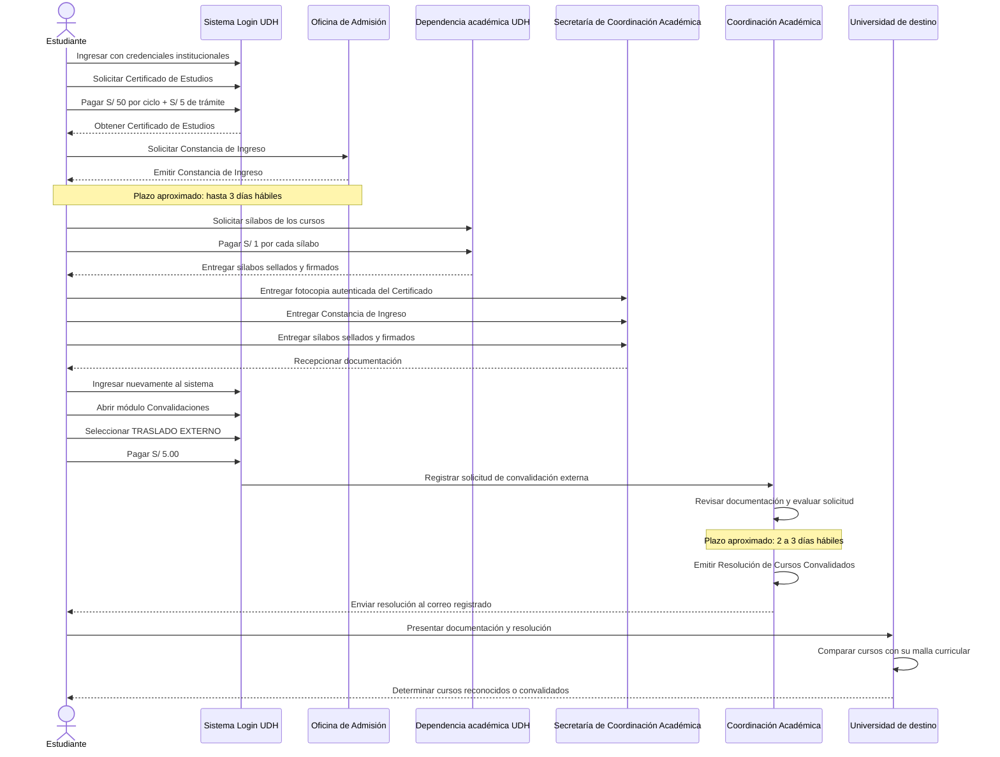
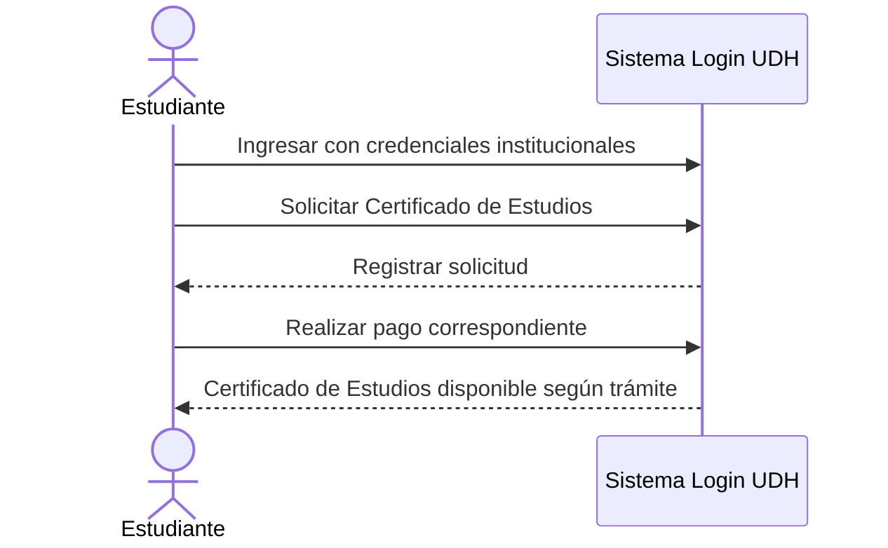
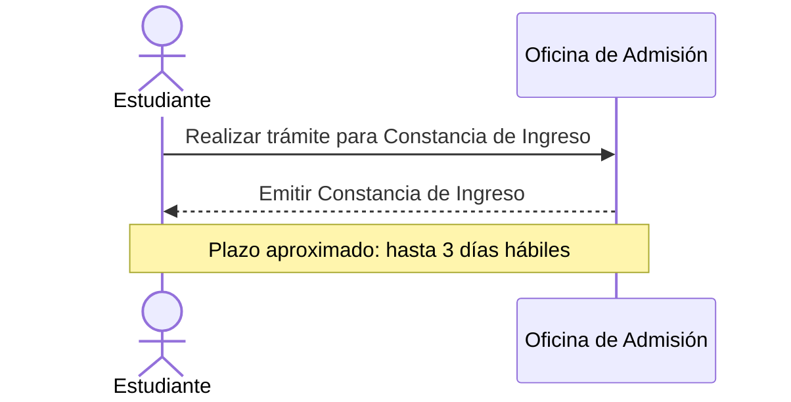
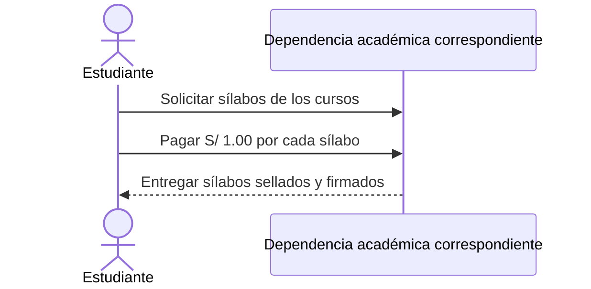
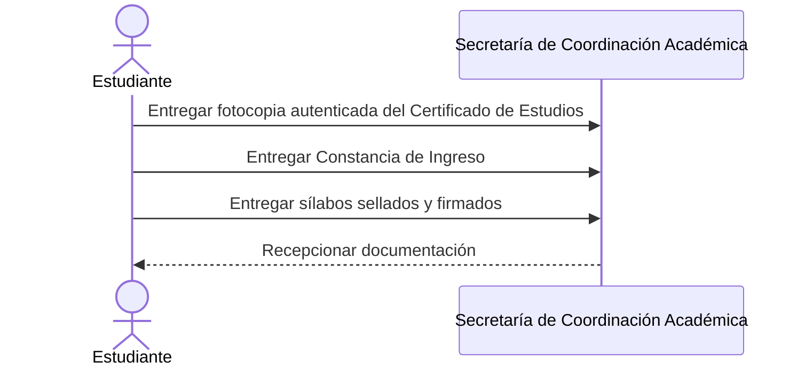
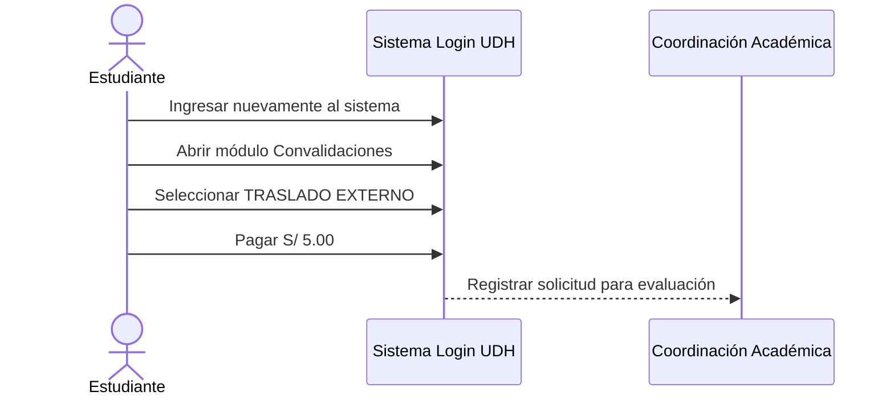
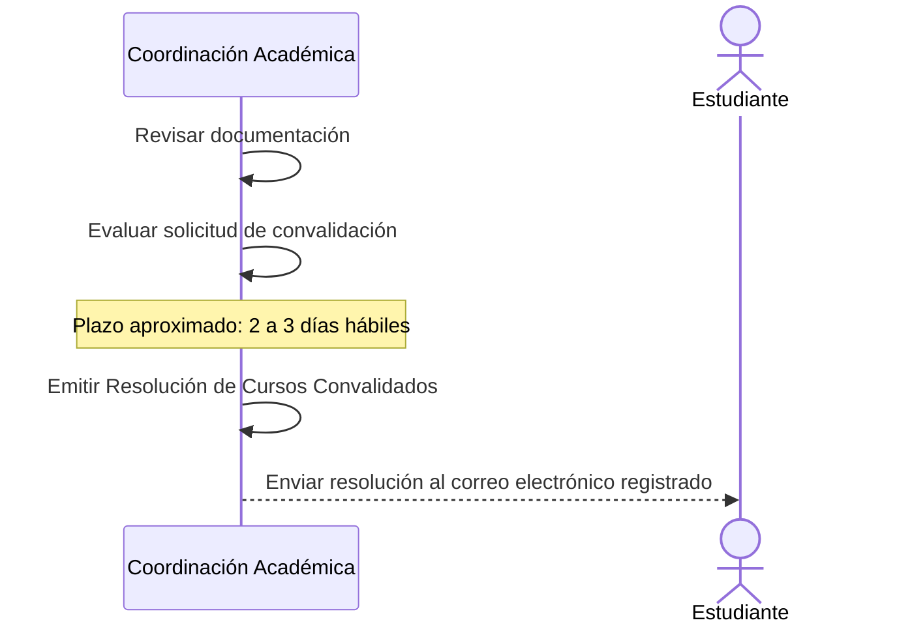
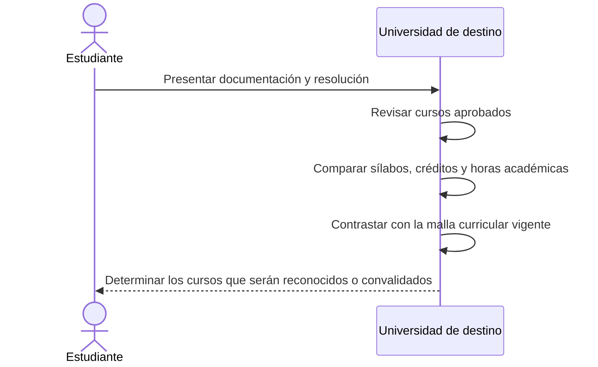

[ConvalidacionExterna.md](https://github.com/user-attachments/files/32838603/ConvalidacionExterna.md)
# Proceso de Convalidación por Traslado Externo — UDH

> **Universidad de Huánuco (UDH)**  
> **Programa Académico de Ingeniería de Sistemas e Informática**
>
> Documento organizado para consulta rápida en GitHub. El flujo conserva los pasos, costos, documentos y plazos indicados en el material de referencia proporcionado.

---

## 1. Actores

| Código | Actor | Rol dentro del proceso |
|---|---|---|
| EST | Estudiante | Inicia el trámite, solicita documentos, realiza pagos y presenta requisitos. |
| ADM | Oficina de Admisión | Emite la Constancia de Ingreso. |
| SEC | Secretaría de Coordinación Académica | Recibe la documentación del estudiante. |
| COOR | Coordinación Académica | Revisa la documentación, evalúa y emite la resolución. |
| DEST | Universidad de destino | Evalúa los cursos frente a su propia malla curricular y determina cuáles reconoce. |

---

## 2. Ruta del trámite

**Login UDH → Convalidaciones → Externo**

> [!IMPORTANT]
> El estudiante debe seleccionar **TRASLADO EXTERNO** y no **Interno**.

---

## 3. Costos

| Concepto | Costo |
|---|---:|
| Certificado de Estudios | **S/ 50.00 por cada ciclo académico cursado** |
| Derecho de trámite del Certificado de Estudios | **S/ 5.00** |
| Sílabos | **S/ 1.00 por cada sílabo solicitado** |
| Solicitud de convalidación externa | **S/ 5.00** |

---

## 4. Documentos requeridos

| N.° | Documento | Condición |
|---:|---|---|
| 1 | Fotocopia autenticada del Certificado de Estudios | Se presenta la copia autenticada; **no se entrega el original**. |
| 2 | Constancia de Ingreso | Emitida por la Oficina de Admisión. |
| 3 | Sílabos | Deben estar **sellados y firmados** por la autoridad competente. |

> [!WARNING]
> Para la entrega en la Secretaría de Coordinación Académica **no se presenta el Certificado de Estudios original**.

---

## 5. Plazos

| Hito | Plazo aproximado |
|---|---|
| Obtención de la Constancia de Ingreso | **Hasta 3 días hábiles** |
| Evaluación por la Coordinación Académica | **De 2 a 3 días hábiles** |

---

## 6. Diagrama de secuencia general del proceso


---

## 7. Etapa 1 — Certificado de Estudios

El estudiante ingresa al **Sistema Login UDH** con sus credenciales institucionales y solicita el **Certificado de Estudios**.

**Pagos de esta etapa:**

- **S/ 50.00 por cada ciclo académico cursado**.
- **S/ 5.00** por derecho de trámite.



**Salida:** Certificado de Estudios obtenido para continuar con el proceso.

---

## 8. Etapa 2 — Constancia de Ingreso

El estudiante obtiene la **Constancia de Ingreso emitida por la Oficina de Admisión**.

**Plazo aproximado:** hasta **3 días hábiles**.



**Salida:** Constancia de Ingreso.

---

## 9. Etapa 3 — Obtención de Sílabos

El estudiante solicita los sílabos de los cursos que serán utilizados en el proceso de convalidación.

**Costo:** **S/ 1.00 por cada sílabo solicitado**.

Los sílabos deben encontrarse **sellados y firmados por la autoridad competente**.



**Salida:** Sílabos válidos para la evaluación.

---

## 10. Etapa 4 — Entrega de documentos

El estudiante reúne y entrega en la **Secretaría de la Coordinación Académica del Programa Académico de Ingeniería de Sistemas e Informática**:

1. Fotocopia autenticada del Certificado de Estudios.
2. Constancia de Ingreso.
3. Sílabos sellados y firmados.



**Salida:** Documentación presentada ante la Secretaría de Coordinación Académica.

---

## 11. Etapa 5 — Registro de Convalidación Externa

Después de entregar la documentación, el estudiante ingresa nuevamente al **Sistema Login UDH** y sigue la ruta:

**Login UDH → Convalidaciones → Externo**

Luego realiza el pago de **S/ 5.00** y registra la solicitud.



**Salida:** Solicitud de convalidación externa registrada.

---

## 12. Etapa 6 — Evaluación y Resolución

La **Coordinación Académica** revisa la documentación y realiza el procedimiento correspondiente.

**Plazo aproximado:** **2 a 3 días hábiles**.

Al finalizar, emite la **Resolución de Cursos Convalidados** y la envía al **correo electrónico registrado** del estudiante.



**Salida:** Resolución de Cursos Convalidados recibida por el estudiante.

---

## 13. Etapa 7 — Evaluación en la Universidad de destino

El estudiante continúa el procedimiento ante la **Universidad de destino**. Esta institución revisa los cursos realizados y los compara con su propia **malla curricular**.

La evaluación puede considerar:

- Cursos aprobados.
- Contenido de los sílabos.
- Créditos académicos.
- Horas académicas.
- Correspondencia entre asignaturas.
- Malla curricular vigente.



**Resultado final:** la Universidad de destino determina cuáles de los cursos realizados serán reconocidos dentro de su programa académico.

---

## 14. Resumen rápido

```text
1. Login UDH
2. Solicitar Certificado de Estudios
3. Pagar S/ 50 por ciclo + S/ 5 de trámite
4. Obtener Constancia de Ingreso
5. Solicitar sílabos y pagar S/ 1 por cada uno
6. Reunir documentos
7. Entregar documentos en Secretaría de Coordinación Académica
8. Login UDH → Convalidaciones → Externo
9. Pagar S/ 5
10. Evaluación de Coordinación Académica
11. Recibir Resolución de Cursos Convalidados por correo
12. Continuar el procedimiento en la Universidad de destino
```
