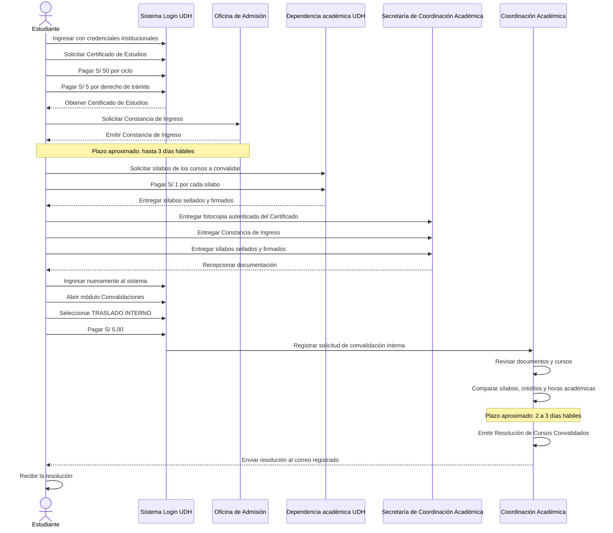
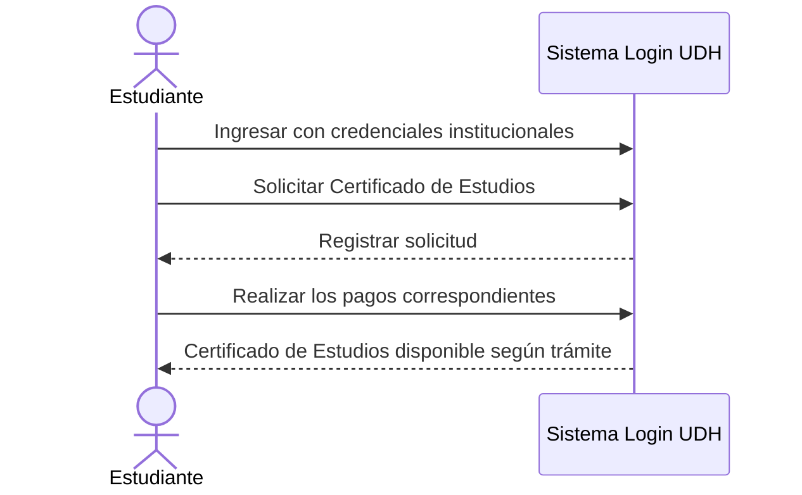
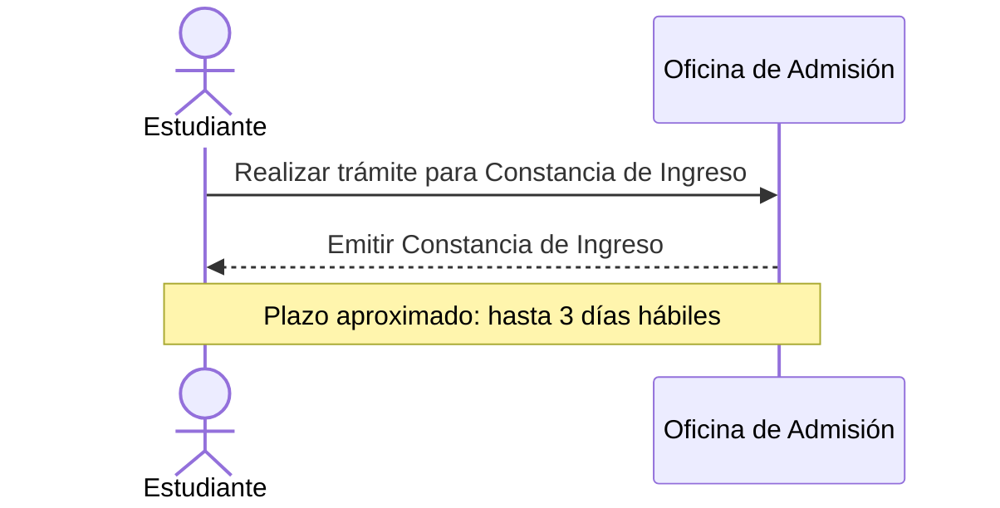
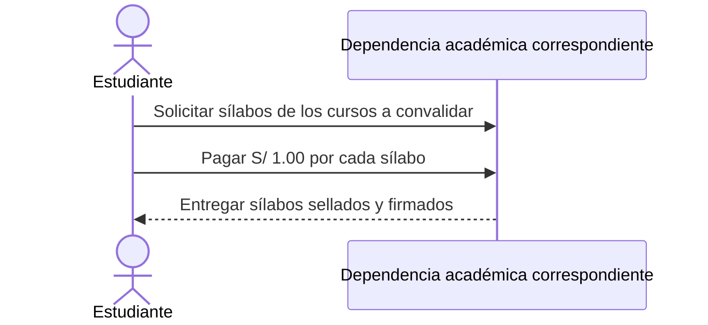
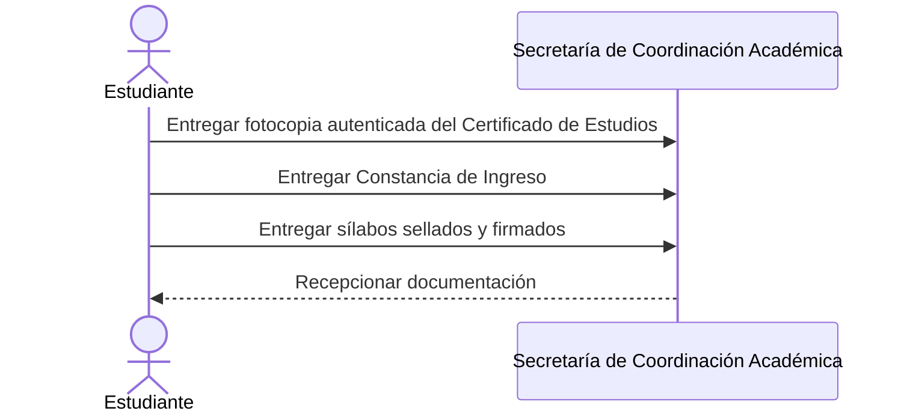
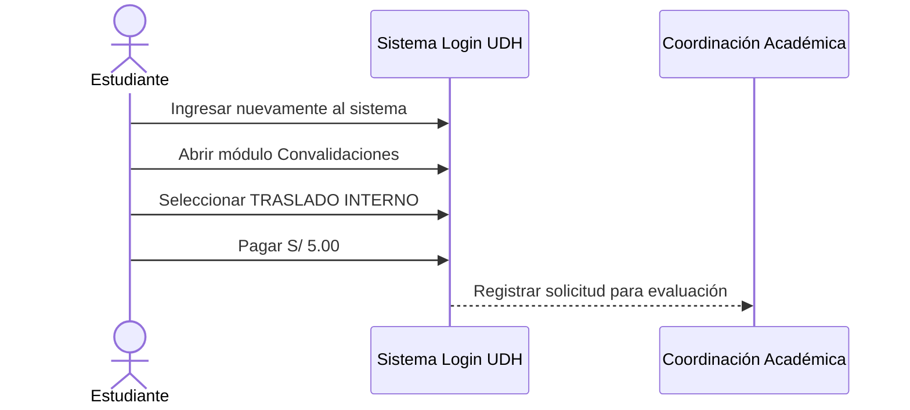
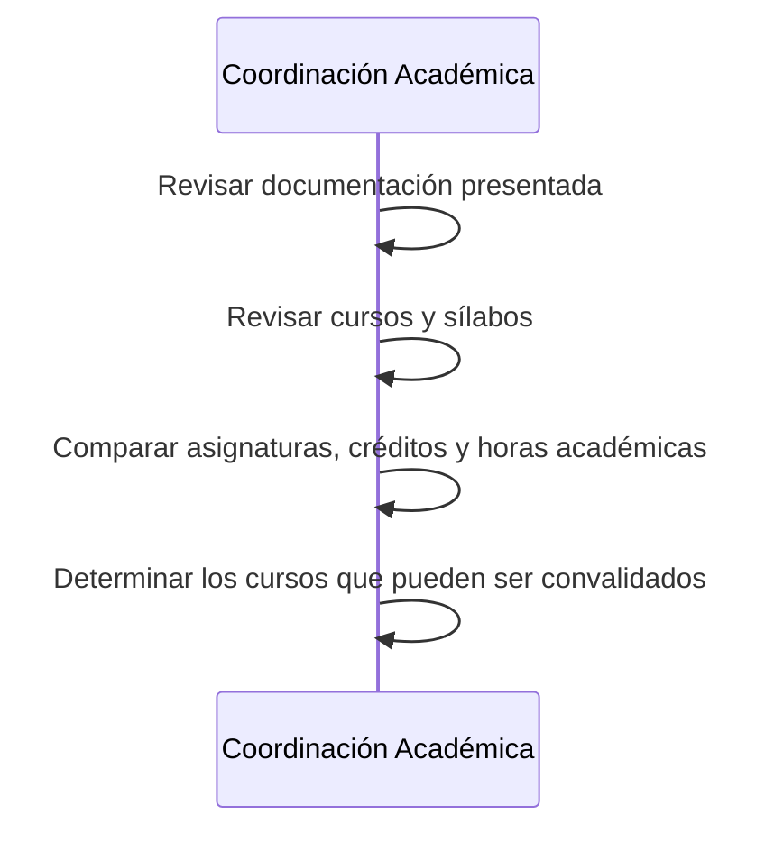
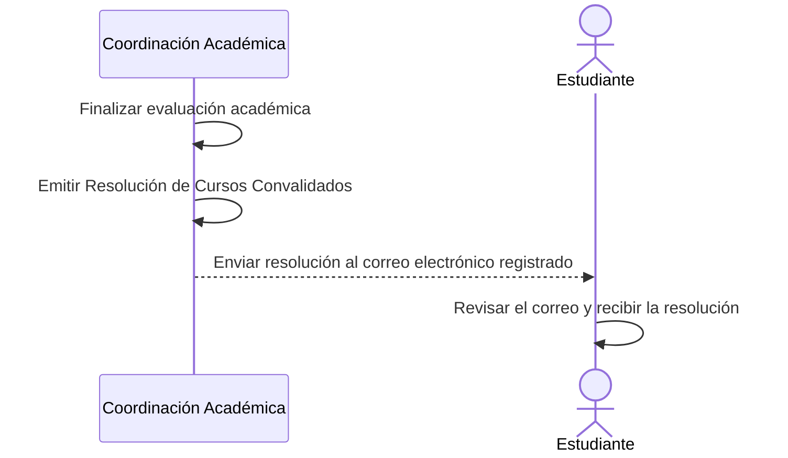

[ConvalidacionInterna.md](https://github.com/user-attachments/files/32838678/ConvalidacionInterna.md)
# Proceso de Convalidación por Traslado Interno — UDH

> **Universidad de Huánuco (UDH)**  
> **Programa Académico de Ingeniería de Sistemas e Informática**
>
> Documento organizado para consulta rápida en GitHub. El flujo conserva los pasos, costos, documentos y plazos indicados en el material de referencia proporcionado.

---

## 1. Actores

| Código | Actor | Rol dentro del proceso |
|---|---|---|
| EST | Estudiante | Inicia el trámite, solicita documentos, realiza pagos y presenta requisitos. |
| ADM | Oficina de Admisión | Emite la Constancia de Ingreso. |
| SEC | Secretaría de Coordinación Académica | Recibe la documentación requerida. |
| COOR | Coordinación Académica | Revisa los documentos, evalúa los cursos y emite la resolución. |

---

## 2. Ruta del trámite

**Login UDH → Convalidaciones → Interno**

> [!IMPORTANT]
> El estudiante debe verificar que haya seleccionado **TRASLADO INTERNO** y no **Externo**.

---

## 3. Costos

| Concepto | Costo |
|---|---:|
| Certificado de Estudios | **S/ 50.00 por cada ciclo académico cursado** |
| Derecho de trámite del Certificado de Estudios | **S/ 5.00** |
| Sílabos | **S/ 1.00 por cada sílabo solicitado** |
| Solicitud de convalidación interna | **S/ 5.00** |

---

## 4. Documentos requeridos

| N.° | Documento | Condición |
|---:|---|---|
| 1 | Fotocopia autenticada del Certificado de Estudios | Se presenta la copia autenticada; **no se entrega el original**. |
| 2 | Constancia de Ingreso | Emitida por la Oficina de Admisión. |
| 3 | Sílabos | Deben estar **sellados y firmados** por la autoridad competente. |

> [!WARNING]
> Para el traslado interno **NO se entrega el Certificado de Estudios original**. Se presenta una **fotocopia autenticada**.

---

## 5. Plazos

| Hito | Plazo aproximado |
|---|---|
| Obtención de la Constancia de Ingreso | **Hasta 3 días hábiles** |
| Proceso de evaluación de la convalidación | **2 a 3 días hábiles** |

---

## 6. Diagrama de secuencia general del proceso


---

## 7. Etapa 1 — Inicio y Certificado de Estudios

El estudiante inicia el procedimiento mediante el **Sistema Login de la Universidad de Huánuco (UDH)** y solicita el **Certificado de Estudios**.

**Pagos de esta etapa:**

- **S/ 50.00 por cada ciclo académico cursado**.
- **S/ 5.00** por derecho de trámite.



**Salida:** Certificado de Estudios obtenido para continuar con el proceso.

---

## 8. Etapa 2 — Constancia de Ingreso

El estudiante obtiene la **Constancia de Ingreso emitida por la Oficina de Admisión**.

**Plazo aproximado:** hasta **3 días hábiles**.



**Salida:** Constancia de Ingreso emitida por la Oficina de Admisión.

---

## 9. Etapa 3 — Obtención de Sílabos

El estudiante identifica los cursos que desea convalidar y solicita los **sílabos correspondientes a dichas asignaturas**.

**Costo:** **S/ 1.00 por cada sílabo solicitado**.

Los sílabos deben encontrarse **sellados y firmados por la autoridad competente**.



**Salida:** Sílabos válidos para la evaluación de equivalencia.

---

## 10. Etapa 4 — Presentación de documentos

El estudiante reúne y entrega en la **Secretaría de la Coordinación Académica del Programa Académico de Ingeniería de Sistemas e Informática**:

1. Fotocopia autenticada del Certificado de Estudios.
2. Constancia de Ingreso emitida por la Oficina de Admisión.
3. Sílabos sellados y firmados de los cursos que desea convalidar.



**Salida:** Documentación presentada para continuar con el procedimiento académico.

---

## 11. Etapa 5 — Registro de Convalidación Interna

Después de entregar los documentos, el estudiante ingresa nuevamente al **Sistema Login UDH** y sigue la ruta:

**Login UDH → Convalidaciones → Interno**

Luego realiza el pago de **S/ 5.00** y registra la solicitud de **Convalidación por Traslado Interno**.



**Salida:** Solicitud de convalidación interna registrada.

---

## 12. Etapa 6 — Evaluación de los cursos

La **Coordinación Académica** revisa los documentos presentados y realiza la comparación académica correspondiente.

La evaluación puede considerar:

- Nombre de la asignatura.
- Contenido del sílabo.
- Créditos académicos.
- Horas académicas.
- Contenidos desarrollados.
- Correspondencia entre asignaturas.
- Malla curricular correspondiente.



**Plazo aproximado del proceso:** **2 a 3 días hábiles**.

---

## 13. Etapa 7 — Emisión y envío de la Resolución

Después de finalizar la evaluación académica, la **Coordinación Académica** emite la **Resolución de Cursos Convalidados**.

La resolución se envía al **correo electrónico registrado en la Universidad de Huánuco**.



**Resultado final:** el estudiante recibe la Resolución de Cursos Convalidados con las asignaturas aprobadas dentro del proceso de traslado interno.

---

## 14. Resumen rápido

```text
1. Login UDH
2. Solicitar Certificado de Estudios
3. Pagar S/ 50 por ciclo + S/ 5 de trámite
4. Obtener Constancia de Ingreso
5. Solicitar sílabos y pagar S/ 1 por cada uno
6. Reunir documentos
7. Entregar documentos en Secretaría de Coordinación Académica
8. Login UDH → Convalidaciones → Interno
9. Pagar S/ 5
10. Registrar solicitud
11. Evaluación de cursos y sílabos
12. Plazo aproximado: 2 a 3 días hábiles
13. Recibir Resolución de Cursos Convalidados por correo
```
